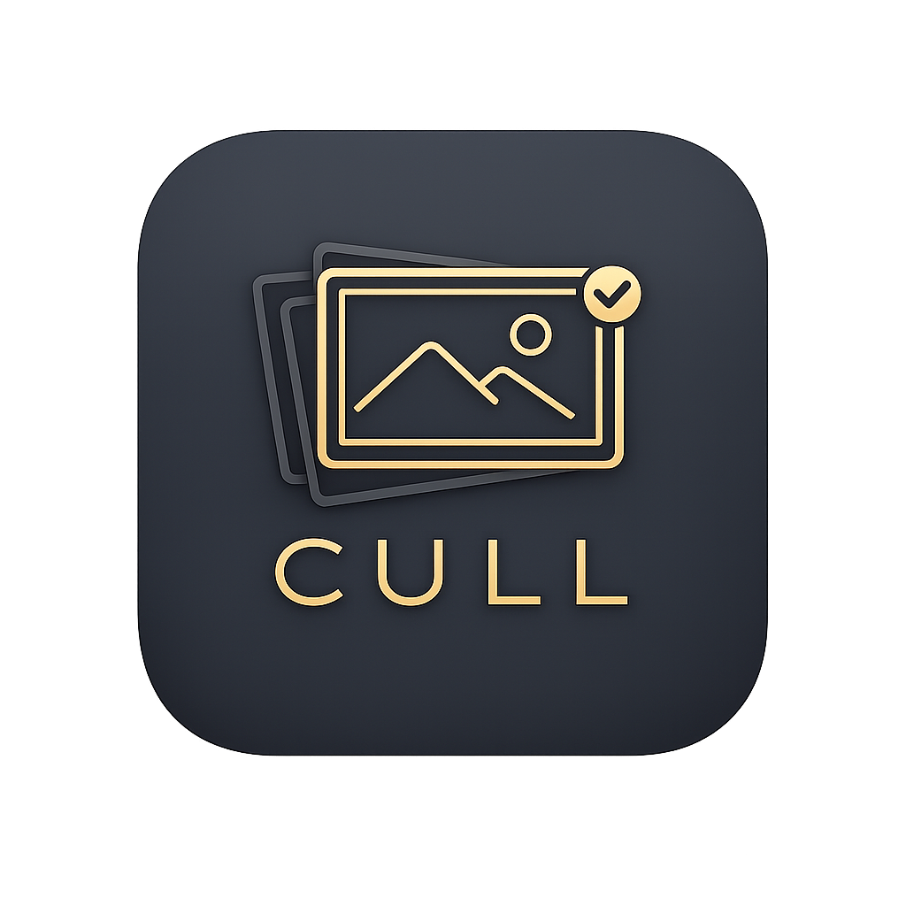
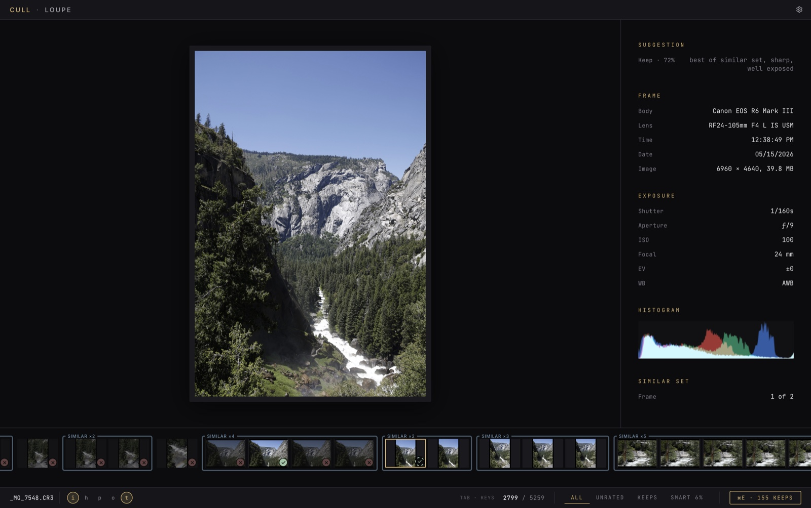
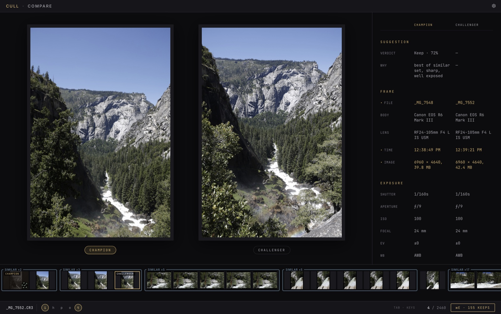
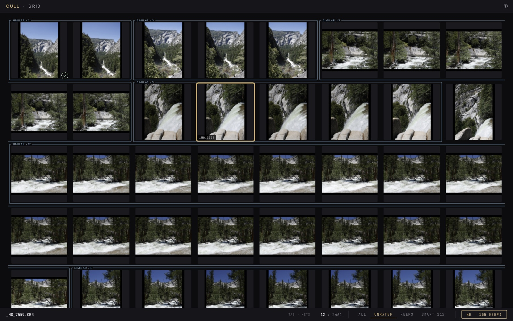

# CULL

**Keyboard-fast culling for Canon CR3 RAW photos.**

CULL is a desktop app for photographers who come home from a shoot with
thousands of CR3 frames and want the keep/reject pass done in minutes, not
evenings. Open a folder, judge each frame by keyboard, and your verdicts save
into Lightroom-Classic-compatible XMP sidecars — cull first, then import only
the keepers into your editor of choice.

- **LOUPE** — one image at a time, hold-to-scrub navigation
- **COMPARE** — champion vs challenger, side by side
- **GRID** — contact sheet with the same rating vocabulary

CULL never touches your CR3 files. The only thing it writes is a
`{basename}.xmp` sidecar next to each image — and its own verdicts only; your
Lightroom star ratings are never overwritten.

**Supported platforms: Windows (x64) and macOS (Apple Silicon).** Linux and
mobile are intentionally unsupported and blocked at compile time.

| Loupe | Compare | Grid |
| ----- | ------- | ---- |
|  |  |  |

## Running CULL

### Windows

If you have a built `CULL.exe` (Windows), double-click it.

The first launch may show a SmartScreen warning ("Windows protected your PC")
because CULL isn't code-signed. Click **More info → Run anyway**. This is a
one-time thing per machine.

If WebView2 isn't already installed (it ships with Windows 10 21H2+ and all
Windows 11), the installer will fetch it the first time. After that, CULL
launches normally.

### macOS

Download the `.dmg` from the GitHub Releases page (Apple Silicon only), or
build locally. Drag the app out of the DMG into `/Applications` before first
run (avoids App Translocation).

A downloaded DMG is unsigned and un-notarized, so the first launch needs
**right-click → Open** (or System Settings → Privacy & Security → "Open
Anyway", or `xattr -d com.apple.quarantine /Applications/CULL.app`). Locally
built apps carry no quarantine attribute and launch directly.

Expect one-time macOS permission prompts on first access to
Desktop/Documents/Downloads, SD cards (removable volumes), and NAS (network
volumes) — normal TCC behavior, no action needed.

## Smart culling

CULL can pre-judge a shoot and surface suggestions — **advisory only, always.
Nothing is ever rated or written by the analysis**; suggestions appear as
ghost dots and grouped "burst"/"Similar ×N" visuals, and every verdict stays
yours. The `4` filter tab collects the suggestions (re-press to cycle
rejects / keeps / favorites).

Two layers:

- **Classical tier (always available):** per-frame quality metrics computed
  in Rust from the embedded previews — sharpness at the AF point, exposure,
  clipping, texture — plus burst grouping from capture cadence and
  perceptual-hash near-duplicate grouping. Pure Rust, no ML runtime.
- **Deep analysis (optional ML tier):** local ONNX models add face detection
  (YuNet), eyes-open classification (OCEC), look-alike grouping (DINOv2
  embeddings), and aesthetic-ranked favorite suggestions (CLIP + LAION head).
  Everything runs on-device; no image ever leaves your machine.

Both layers are controlled in Settings (**Smart culling** section): a master
switch for suggestions, a confidence level for how sure a reject suggestion
must be before it shows, analyze-on-open, and the **Deep analysis** toggle
for the ML tier. Builds compiled without the model runtime
(`--no-default-features`) simply leave the ML signals empty.

The bundled/fetched models and their licenses are listed in
[THIRD_PARTY_NOTICES.md](THIRD_PARTY_NOTICES.md).

## Building from source

You'll need:

- **Node 20+** and **pnpm 9+** (`npm i -g pnpm`)
- **Rust stable** (`rustup toolchain install stable`)
- A Tauri-supported toolchain. Windows: Visual Studio Build Tools with the
  Desktop C++ workload. macOS: Xcode Command Line Tools. See
  [tauri.app/start/prerequisites](https://tauri.app/start/prerequisites).
  (Linux is compile-blocked — builds fail by design.)

Then:

```bash
pnpm install                # JS deps + Rust crates fetched on first build
./scripts/fetch-models.sh   # once per clone: pulls the CLIP + DINOv2 models (see scripts/ below)
pnpm tauri dev              # dev mode with hot reload
pnpm tauri build            # release binary in src-tauri/target/release/bundle/
```

The first Rust build takes ~15 minutes. Incremental builds are fast.

## Sharing the built app

After `pnpm tauri build`, the installers live at:

```
src-tauri/target/release/bundle/nsis/CULL_<version>_x64-setup.exe   (Windows)
src-tauri/target/release/bundle/dmg/CULL_<version>_aarch64.dmg      (macOS)
src-tauri/target/release/bundle/macos/CULL.app                      (macOS, raw app)
```

The Windows `.exe` is self-contained — it bundles the WebView2 bootstrapper,
so a fresh PC without WebView2 will still install cleanly. Hand it to anyone
on Windows 10/11 (x64) and they can install and run it.

Caveats:

- Neither installer is code-signed: SmartScreen warns on Windows, and macOS
  needs the right-click → Open dance (see "Running CULL" above).
- Windows on ARM and Intel Macs are not supported by these builds.
- A local `pnpm tauri build` produces only the current platform's installer;
  CI (below) builds both from one tag.

## Releases

Push a `v*` tag and GitHub Actions builds both installers into a draft
release:

```bash
git tag v0.1.1 && git push origin v0.1.1
```

The workflow (`.github/workflows/release.yml`) runs `scripts/fetch-models.sh`
and then `tauri build` on `windows-latest` (NSIS `.exe`) and `macos-latest`
(aarch64 `.app` + `.dmg`), attaching both installers to a draft GitHub
release named after the tag. Review and publish the draft manually.

Config note: `src-tauri/tauri.macos.conf.json` overrides the window config on
macOS via JSON Merge Patch (RFC 7396) — **arrays are replaced wholesale**, so
any future edit to `app.windows[0]` in `tauri.conf.json` must be mirrored
there.

## Tests

```bash
pnpm test                                          # frontend (Vitest)
cargo test --manifest-path src-tauri/Cargo.toml    # backend
```

See [TESTING.md](TESTING.md) for the full picture: the env-var-gated
corpus tests against real CR3 fixtures, the smart-culling calibration
harness, and the pass-by-skip philosophy that keeps CI green without
fixtures.

## `scripts/`

- **`fetch-models.sh`** — pulls the large ML models kept out of git
  (`clip_vitb32_visual.onnx` ~175 MB, `dinov2s.onnx` ~43 MB) from the
  `models-v1` GitHub release, sha256-pinned with an atomic rename. Run once
  per clone; release CI runs it before every build. Local ML builds (the
  default features) need this once — the embedding/aesthetic paths and
  their corpus smoke tests load these models at runtime.
- **`export-models.py`** — dev-only ONNX exporter for the smart-culling
  models (never shipped, never needed for a build). Exports from official
  weights and parity-gates every graph against the PyTorch original on real
  preview JPEGs (embedding cosine ≥ 0.999, |aesthetic delta| < 0.05) before
  anything is committed. Self-contained `uv` script; see its docstring.

## Keyboard reference

Hold **Tab** at any time inside the cull view for a context-aware reference.
On macOS, `ctrl` means `⌘` throughout (every shortcut accepts either).
Cheat sheet:

| Key | Loupe | Compare | Grid |
| --- | ----- | ------- | ---- |
| `enter`    | keep                | challenger wins      | keep selected      |
| `backspace`| reject              | reject challenger    | reject selected    |
| `f`        | favorite            | —                    | favorite           |
| `u`        | unrate              | —                    | unrate             |
| `← →`      | prev / next (hold to scrub) | pick challenger (hold) | prev / next (hold to traverse) |
| `↑ ↓`      | —                   | —                    | row up / down      |
| `space`    | 1:1 zoom (hold)     | 1:1 zoom (hold)      | —                  |
| `shift+space` | 2:1 zoom         | 2:1 zoom             | —                  |
| `l` `c` `g` | switch view (current view's key is a no-op) | | |
| `esc`      | back, or home confirm if no history | | |
| `i`        | exif + histogram    | exif + histogram     | —                  |
| `h`        | clipping overlay    | clipping overlay     | —                  |
| `p`        | focus peaking       | focus peaking        | —                  |
| `o`        | rule of thirds      | rule of thirds       | —                  |
| `t`        | toggle thumb strip  | toggle candidate strip | —                |
| `1 – 4`    | filter tabs (all / unrated / keeps / smart); re-press cycles sub-modes (keeps→★, smart→rejects/keeps/favs) | — | same |
| `ctrl+z` / `ctrl+shift+z` | undo / redo | undo / redo | undo / redo |
| `ctrl+e`   | finish actions (move rejects / copy keeps) | same | same |
| `ctrl+,`   | settings (also from the home screen) | same | same |

## Rating model

Three states plus the absence of any rating. The pick/good flags (and any star)
are Lightroom-Classic-compatible so verdicts survive a Lightroom round-trip; the
`cull:fav` marker is CULL's own private-namespace attribute that Lightroom
ignores:

| State      | XMP                                                  |
| ---------- | ---------------------------------------------------- |
| reject     | `xmpDM:pick="-1"`, `xmpDM:good="false"`              |
| keep       | `xmpDM:pick="1"`,  `xmpDM:good="true"`               |
| favorite   | `xmpDM:pick="1"`,  `xmpDM:good="true"`, `cull:fav` (+ a courtesy `xmp:Rating="1"` only when the frame had no user star) |
| (unrated)  | no pick attribute                                    |

User stars 2–5 (LrC's edit-pass ratings) are never touched by CULL. A favorite on
a starless frame gets a courtesy 1★ (`cull:fav="star"`, removed on demote); a
favorite on a frame that already carries a user 1–5★ rides that star
(`cull:fav="flag"`) and never overwrites it — so a user's 3★ keep stays a 3★
favorite round-trip.

## Settings

Open with **Ctrl+,** or the gear icon on the home screen.

- **Storage mode** (`local` / `network`) — switches a performance profile
  with different concurrency, prefetch, and cache window numbers. Default
  `local`; flip to `network` if you're culling from a NAS / SMB share.
- **Smart culling** — suggestions master switch, reject-confidence level,
  analyze-on-open, and the Deep analysis (ML) toggle (see "Smart culling"
  above).
- **When you start a cull** — default filter, default overlays (info,
  clipping, peaking, thirds), default thumbnail strip.
- **File operations** — name of the rejected-subfolder created by
  "move rejects", default destination for "copy keeps" (ask each time or
  use a pinned folder).
- **On launch** — re-open the last folder automatically.

## Project layout

```
cull/
├── src/                        # React + TS frontend
│   ├── App.tsx                 # orchestration + state machinery
│   ├── App.css
│   ├── main.tsx
│   ├── components/             # presentational components
│   │   ├── pane/               # PhotoPane: the shared loupe/compare pane recipe
│   │   └── strip/              # PhotoStrip family: film strip + virtualizer
│   ├── hooks/                  # settings, recents, focus trap
│   ├── image/                  # imageStore tiers, presenter, decode pool
│   ├── overlays/               # clipping/peaking masks, histogram (+ worker)
│   ├── smart/                  # smart culling: bursts, similar, verdicts
│   ├── utils/                  # pure helpers (filter, format, path, snap, …)
│   └── types/                  # shared TS types
├── src-tauri/
│   ├── src/
│   │   ├── lib.rs              # Tauri command wiring + app setup
│   │   ├── main.rs             # entry point (Windows console guard)
│   │   ├── cr3.rs              # pure-Rust CR3 parser
│   │   ├── bundle.rs           # preview/full-res read commands
│   │   ├── scan.rs             # scan_folder + analyze_folder
│   │   ├── analyze.rs          # classical quality metrics
│   │   ├── embed.rs            # DINOv2 embeddings + CLIP/LAION aesthetic
│   │   ├── faces.rs            # YuNet face detection + OCEC eye state
│   │   ├── ml_models.rs        # lazy ONNX session registry
│   │   ├── phash.rs            # 64-bit DCT perceptual hash
│   │   ├── midtier.rs          # generated mid-resolution tier
│   │   ├── tier_cache.rs       # on-disk preview/mid cache
│   │   ├── io_gate.rs          # global I/O admission (NAS backpressure)
│   │   ├── memory_pressure.rs  # jetsam defense (macOS memory watch)
│   │   ├── xmp.rs              # XMP sidecar I/O (atomic writes)
│   │   ├── file_ops.rs         # move / copy after the cull
│   │   └── meta.rs             # ImageMetadata shared with the UI
│   ├── models/                 # bundled ONNX models (see THIRD_PARTY_NOTICES.md)
│   └── Cargo.toml
├── scripts/                    # fetch-models.sh, export-models.py (see above)
├── docs/                       # architecture history + media
└── sample_cr3s/                # real-CR3 fixtures for env-var-gated tests
```

See [ARCHITECTURE.md](./ARCHITECTURE.md) for the design notes behind the
read pipeline, XMP scheme, smart culling, and site navigation.

## License

MIT — see [LICENSE](LICENSE). Bundled ML models carry their own licenses,
listed in [THIRD_PARTY_NOTICES.md](THIRD_PARTY_NOTICES.md).
